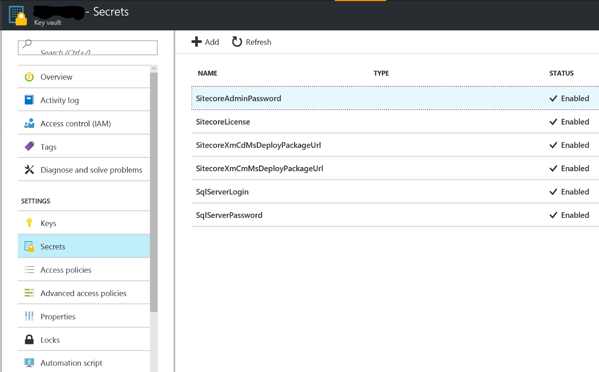
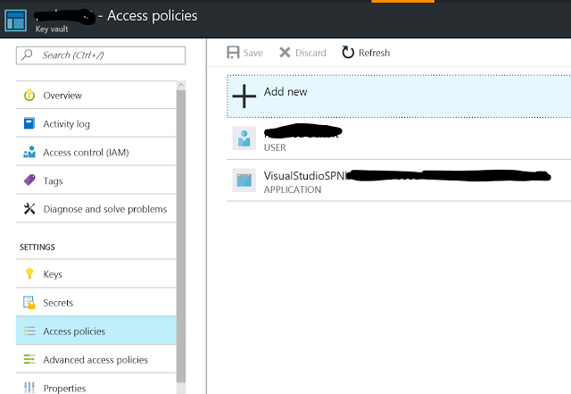
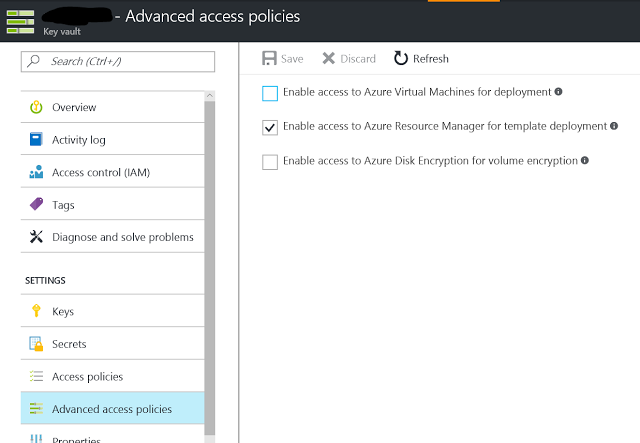

# Azure KeyVault integration for my-xm and my-xm-slot ARM Templates

This folder contains the script to store in [Azure KeyVault](https://docs.microsoft.com/en-us/azure/key-vault/key-vault-whatis) the secrets necessary for [my-xm](../my-xm) and [my-xm-slot](../my-xm-slot) deployments.

Here are the Secrets stored:
 
  * SitecoreLicense - the Sitecore License.xml file
  * SqlServerLogin - the login to connect on the SQL Server
  * SqlServerPassword - the password to connect on the SQL Server
  * SitecoreAdminPassword - the password of the Sitecore admin web console/area
  * SitecoreXmCdMsDeployPackageUrl - The url of the Sitecore XM MSDeploy package (CD)
  * SitecoreXmCmMsDeployPackageUrl - The url of the Sitecore XM MSDeploy package (CM)
    
You could use [this script](./deploy-keyvault.ps1) and adapt it for your own deployments.

TIPS for the value of the `VSTSServicePrincipalName` parameter: if you are going to use VSTS to manage your [my-xm](../my-xm) and [my-xm-slot](../my-xm-slot) deployments like explained on this [blog article](https://alwaysupalwayson.blogspot.com/2017/03/advanced-sitecore-arm-templates.html), you will need to follow these steps below to get the value of the `VSTSServicePrincipalName` parameter:

- In VSTS, create an [Azure Resource Manager service endpoint](https://www.visualstudio.com/en-us/docs/build/concepts/library/service-endpoints#sep-azure-rm)
  - It will be automatically done/set up for you like explain in [this link](https://blogs.msdn.microsoft.com/visualstudioalm/2015/10/04/automating-azure-resource-group-deployment-using-a-service-principal-in-visual-studio-online-buildrelease-management/) (but the manual approach could be done as well)
- Once the endpoint is created, click on it to open it and then click on the "Manage Service Principal" link.
- The old Azure portal will be opened on the associated Active Directory service
- Click on "Configure" and scroll down until you find the `APP ID URI` field under the `Single sign-on` section.
- This value will be what you have to pass for the `VSTSServicePrincipalName` parameter of the PowerShell script.
  - If the endpoint was created automatically by VSTS, the value should be something like: "https://VisualStudio/SPN..."

After running the script properly you should see these results within the Azure portal for the associated Azure KeyVault service created:

